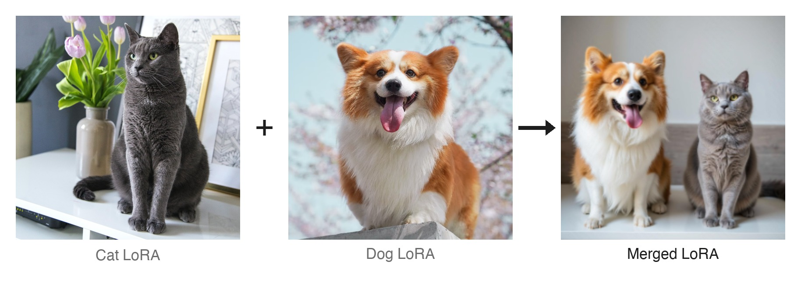

# SSR-Merge

Give SSR-Merge a few LoRAs trained on the same base model and one text
prompt per LoRA — no ground-truth images, no extra training. It runs a
short calibration pass on one GPU and writes out a regular LoRA file you
can load like any other.

> Paper: *SSR-Merge: Subspace Signal Routing for Training-Free LoRA
> Merging in Diffusion Models* (ICML 2026).
> Zhengxuan Wei, Yi Dong, Zonghui Li, Xianhui Lin, Xing Liu, Hong Gu,
> Shaofeng Zhang, Wenbin Li, Qi Fan.

---

## Installation

```bash
git clone https://github.com/nagara214/SSR-Merge.git
cd SSR-Merge
pip install -r requirements.txt
```

Requirements: Python 3.9+, PyTorch 2.1+, and
[`diffsynth-studio`](https://github.com/modelscope/DiffSynth-Studio).

---

## Quick start

```bash
# Reproduce the paper's cat + dog merge on FLUX.1-dev (default):
python demo.py

# Or pick another backbone and bring your own LoRAs:
python demo.py --backbone qwen \
    --loras task_a.safetensors task_b.safetensors \
    --prompts "a photo of ..." "a photo of ..."
```

Before the default run, download the paper's cat and dog DreamBooth LoRAs
from
[Google Drive](https://drive.google.com/drive/folders/1riatiorE8WYgKGUgc8ZwARv_O37Ui_hu)
and place the two `.safetensors` files in `demo_loras/`. The command then
merges them into `merged_flux.safetensors`.

`demo.py` covers five DiT-based backbones out of the box: `flux`,
`qwen`, `z_image`, `hidream`, `flux2`. The `--loras` arguments accept
local paths or HuggingFace `org/repo[:filename]` specs.

A cat LoRA and a dog LoRA, merged by SSR into one LoRA that composes both
subjects faithfully in a single image:

<p align="center">
  
</p>

---

## Citation

```bibtex
@inproceedings{wei2026ssrmerge,
  title={SSR-Merge: Subspace Signal Routing for Training-Free LoRA Merging in Diffusion Models},
  author={Wei, Zhengxuan and Dong, Yi and Li, Zonghui and Lin, Xianhui and Liu, Xing and Gu, Hong and Zhang, Shaofeng and Li, Wenbin and Fan, Qi},
  booktitle={ICML},
  year={2026},
}
```

## License

Apache 2.0. See [`LICENSE`](LICENSE).
